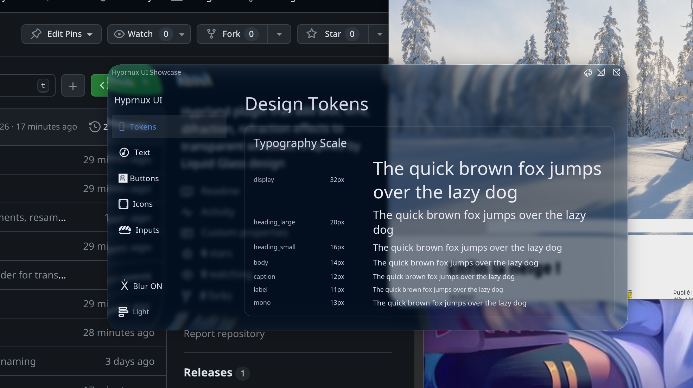
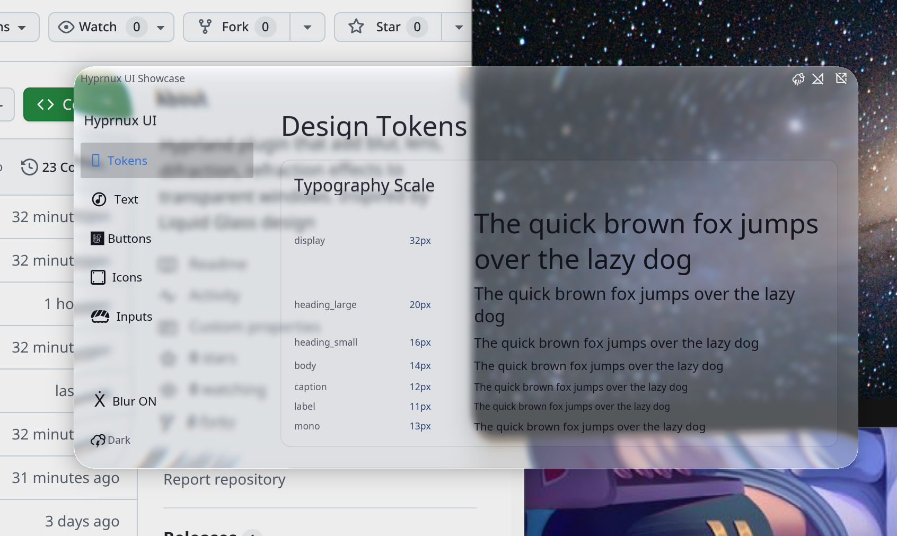

# HyprGlass - Liquid Glass inspired plugin for Hyprland

Liquid Glass for [Hyprland](https://hyprland.org/).

Frosted blur, edge refraction, chromatic aberration, specular highlights — fully customizable, per-theme, on every window.

| Dark | Light |
|:---:|:---:|
|  |  |

## Installation

### hyprpm (recommended)

Builds against your exact Hyprland version, no ABI mismatch headaches:

```bash
hyprpm add https://github.com/hyprnux/hyprglass
hyprpm enable HyprGlass
```

### Pre-built release

Grab `hyprglass.so` from [Releases](https://github.com/hyprnux/hyprglass/releases/latest). Each release targets a specific Hyprland API version — check the release notes to confirm it matches yours.

```bash
hyprctl plugin load /path/to/hyprglass.so
```

Or persist it in your config:

```ini
plugin = /path/to/hyprglass.so
```

### Manual build

```bash
make
hyprctl plugin load $(pwd)/hyprglass.so
```

## Configuration

Everything goes under `plugin:hyprglass:` in your Hyprland config.

### Theme and presets

Configuration uses:

- **Preset** – named set of settings that can be inherited, global or given by the "hyprglass-aware" window through tag.
- **Theme** (`dark` / `light`) – fine tuning (brightness, contrast, saturation, adaptive dim/boost, ...), global or given by the "hyprglass-aware" window through tag.

Settings resolve through:

1. **Preset** – by priority: theme values, preset shared values, then inherited preset (recursive)
2. **Built-in theme override** (`dark:` / `light:` prefix in settings)
3. **Global value** (no prefix in settings)
4. **Hardcoded theme default**

```ini
plugin:hyprglass {
    default_theme = dark
    default_preset = default

    brightness = 0.9                 # global override
    dark:brightness = 0.82           # built-in dark theme override
    light:adaptive_boost = 0.5       # built-in light theme override

    # Custom preset: shared + per-theme variants
    preset = name:clear, glass_opacity:0.8, blur_strength:1.5
    preset = name:clear:dark, brightness:0.7
    preset = name:clear:light, brightness:1.2
}
```

### Global-only settings

| Option | Type | Default | Description |
|---|---|---|---|
| `enabled` | int | `1` | Enable/disable the effect (0 or 1) |
| `default_theme` | string | `dark` | Default theme: `dark` or `light` |
| `default_preset` | string | `default` | Default preset name |

### Overridable settings

Set globally, per theme with `dark:` / `light:` prefix, or in a preset.

| Option | Type | Global Default | Dark Default | Light Default | Description |
|---|---|---|---|---|---|
| `blur_strength` | float | `2.0` | — | — | Blur radius scale (`value × 12.0` px) |
| `blur_iterations` | int | `3` | — | — | Gaussian blur passes (1-5) |
| `refraction_strength` | float | `0.6` | — | — | Edge refraction intensity (0.0-1.0) |
| `chromatic_aberration` | float | `0.5` | — | — | Spectral dispersion at edges (0.0-1.0) |
| `fresnel_strength` | float | `0.6` | — | — | Edge glow intensity (0.0-1.0) |
| `specular_strength` | float | `0.8` | — | — | Specular highlight brightness (0.0-1.0) |
| `glass_opacity` | float | `1.0` | — | — | Overall glass opacity (0.0-1.0) |
| `edge_thickness` | float | `0.06` | — | — | Bezel width, fraction of smallest dimension (0.0-0.15) |
| `tint_color` | color | `0x8899aa22` | — | — | Glass tint RRGGBBAA hex. Alpha = tint strength |
| `lens_distortion` | float | `0.5` | — | — | Center dome magnification (0.0-1.0) |
| `brightness` | float | — | `0.82` | `1.12` | Brightness multiplier |
| `contrast` | float | — | `0.90` | `0.92` | Contrast around midpoint |
| `saturation` | float | — | `0.80` | `0.85` | Desaturation (0 = grayscale, 1 = full) |
| `vibrancy` | float | — | `0.15` | `0.12` | Selective saturation boost |
| `vibrancy_darkness` | float | — | `0.0` | `0.0` | Vibrancy influence on dark areas (0-1) |
| `adaptive_dim` | float | — | `0.4` | `0.0` | Dims bright areas behind the glass (white is white 0 -to- 1 white becomes black) |
| `adaptive_boost` | float | — | `0.0` | `0.4` | Boosts dark areas behind the glass (black is black 0 -to- 1 black becomes white) |

`—` in Global Default = falls through to per-theme default. `—` in Dark/Light = inherits global value.

### Theme detection

Each window's theme is resolved as:
1. **Window tag** `hyprglass_theme_light` or `hyprglass_theme_dark`
2. **Fallback** to `default_theme`

Set via window rules:
```ini
windowrule = tag +hyprglass_theme_light, class:firefox
```

Or on the fly:
```bash
hyprctl dispatch tagwindow +hyprglass_theme_dark
```

### Presets

Presets are named config overrides. They can be **built-in** (always available) or **user-defined** via the `preset` keyword. User-defined presets with the same name override built-in ones.

Each preset can have:

- **Shared values** (theme-agnostic): `preset = name:mypreset, blur_strength:1.5`
- **Dark variant**: `preset = name:mypreset:dark, brightness:0.7`
- **Light variant**: `preset = name:mypreset:light, brightness:1.2`
- **Inheritance**: `preset = name:mypreset, inherits:otherpreset, ...`

Assign a preset to a window via tags:
```ini
windowrule = tag +hyprglass_preset_high_contrast, class:myterminal
```

Or on the fly:
```bash
hyprctl dispatch tagwindow +hyprglass_preset_subtle
```

#### Built-in presets

These are always available without any config. Use `default_preset` or per-window tags to activate them.

| Preset | Description |
|---|---|
| `high_contrast` | Punchy colors, strong tinting, good contrast between dark and light themes. Lower blur, stronger refraction. |
| `subtle` | Minimal glass effect. Light blur, reduced refraction and highlights. |
| `clear` | Minimal transparent effect. Like a transparent rounded border glass plate. |
| `glass` | Solid glass block effect with a lot of chromatic aberration.. |

To use a built-in preset as default:
```ini
plugin:hyprglass {
    default_preset = high_contrast
}
```

To override a built-in preset, redefine it:
```ini
plugin:hyprglass {
    # Override the built-in high_contrast preset's shared blur
    preset = name:high_contrast, blur_strength:2.0
}
```

**Note:** Those presets are not totaly fine-tuned, but they are a good starting point. Please submit improvments or your own presets through issues or PR (with some screenshots).

#### User-defined presets

Define your own presets, in your Hyprland config, with :

```ini
plugin:hyprglass {
    # Clear preset — transparent look, app chooses this via tag
    preset = name:clear, blur_strength:0.2, blur_iteration: 1, refraction_strength: 1, lens_distortion: 1
    preset = name:clear:dark, brightness:0.7, contrast:1.0
    preset = name:clear:light, brightness:1.2, contrast:0.95

    # Contrasted — inherits from high_contrast, overrides tint
    preset = name:contrasted, inherits:high_contrast, contrast:1.2, adaptive_dim:1.5
    preset = name:contrasted:dark, tint_color:0x02142aa9
}
```

*Increase two last digits of tint colors for more opacity of tint color and more contrast with background*

## How It Works

The window is modeled as a **thick convex glass slab**. The rendering pipeline per window:

1. **Background sampling** — The framebuffer behind the window is captured with padding (content beyond the window boundary is included).
2. **Gaussian blur** — Multi-pass two-pass (horizontal + vertical) Gaussian blur for the frosted look.
3. **Glass height field** — An SDF-based height profile: 1.0 deep inside the window, smooth S-curve to 0.0 at the edge. The transition width is `edge_thickness`.
4. **Edge refraction** — The height field gradient drives UV displacement. At the center the gradient is near-zero (no distortion). At the edges the gradient is steep, pushing sample UVs outward — pulling in content from beyond the window boundary. This creates natural color bleeding.
5. **Chromatic aberration** — R, G, B channels are sampled with slightly different refraction scales (blue bends more), creating spectral fringing at edges.
6. **Center dome lens** — Subtle barrel magnification in the flat interior, controlled by `lens_distortion`.
7. **Frosted tint** — Per-theme tone mapping: adaptive luminance-dependent brightness, contrast, desaturation, and vibrancy applied to the blurred background.
8. **Color tint overlay** — Configurable color tint.
9. **Fresnel edge glow** — Schlick-based fresnel approximation at the glass edge.
10. **Specular highlight + inner shadow** — Top-biased highlight and bottom-rim shadow for depth.

The plugin integrates with Hyprland's render pass system as a `DECORATION_LAYER_BOTTOM` decoration, drawing before the window surface so the glass shows through transparent windows.

## Unloading

```bash
hyprctl plugin unload /path/to/hyprglass.so
```

## Notes

- The plugin requires Hyprland shadows to be present in the render pipeline. It **auto-enables them** at load time if disabled — shadow visual values (range, color…) can be zero, only the decoration's presence matters.

## License

See repository for license details.
